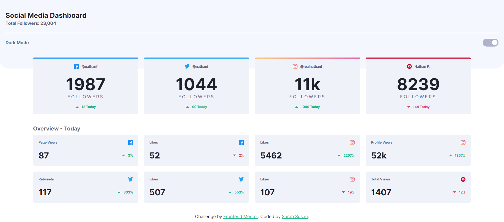
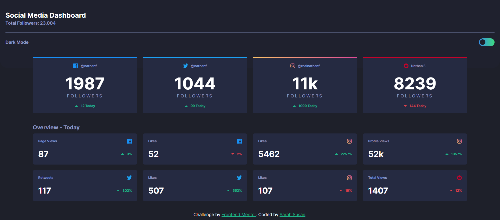
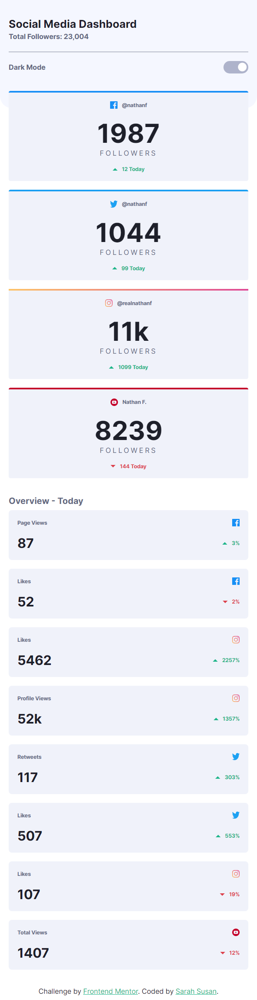
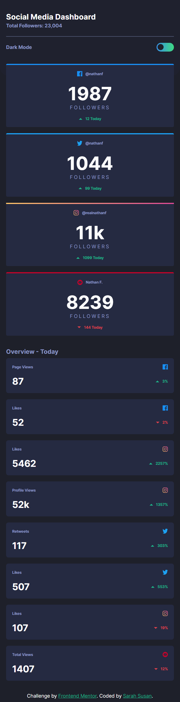

# Frontend Mentor - Social media dashboard with theme switcher solution

This is a solution to the [Social media dashboard with theme switcher challenge on Frontend Mentor](https://www.frontendmentor.io/challenges/social-media-dashboard-with-theme-switcher-6oY8ozp_H). Frontend Mentor challenges help you improve your coding skills by building realistic projects. 

## Table of contents

- [Overview](#overview)
  - [The challenge](#the-challenge)
  - [Screenshot](#screenshot)
  - [Links](#links)
- [My process](#my-process)
  - [Built with](#built-with)
  - [What I learned](#what-i-learned)
  - [Useful resources](#useful-resources)
- [Author](#author)

## Overview
This challenge helped me test my knowlege mainly on flexbox and grids. Additionaly the theme switcher also helped me learn how to dynamically change the color values on user action. I made use of HTML, CSS (with SASS) and Javacript (to locally store the theme in browser).

### The challenge

Users should be able to:

- View the optimal layout for the site depending on their device's screen size
- See hover states for all interactive elements on the page
- Toggle color theme to their preference

### Screenshot

Desktop View

Mobile View

### Links

- Solution URL: [Solution](https://github.com/velvetrose/Social-Media-Dashboard.git)
- Live Site URL: [Live Site](https://velvetrose.github.io/Social-Media-Dashboard/)

## My process
All styling components provided by FeM was stored in a '_config.scss' file which is later imported ito the 'main.scss' file.
I started with a mobile-first workflow with a top-down approach on the elements with my CSS. I made use of both flex and grids for this website.

### Built with

- Semantic HTML5 markup
- CSS custom properties
- Javascript
- Flexbox
- CSS Grid
- Mobile-first workflow
- [Sass](https://sass-lang.com) - Sass extension language for CSS

### What I learned

Learnt to dynamically change themes by just changing the CSS variables in the root. Also, learnt to store the theme in local storage, so that the browser remembers the last set theme during page load/reload.

### Useful resources

- [W3 Schools - Grid Layout](https://www.w3schools.com/css/css_grid.asp) - This is a good reference for using CSS grids.
- [Theme Switching Tutorial - Kevin Powell](https://www.youtube.com/watch?v=fyuao3G-2qg&t=800s) - I found this tutorial really helpful. The :has() pseudo class was a new concept to me until i came across this video.

## Author
- Frontend Mentor - [@velvetrose](https://www.frontendmentor.io/profile/velvetrose)
